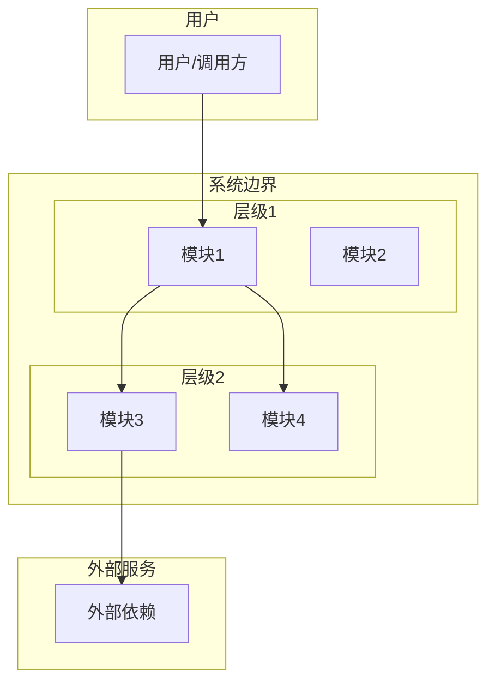
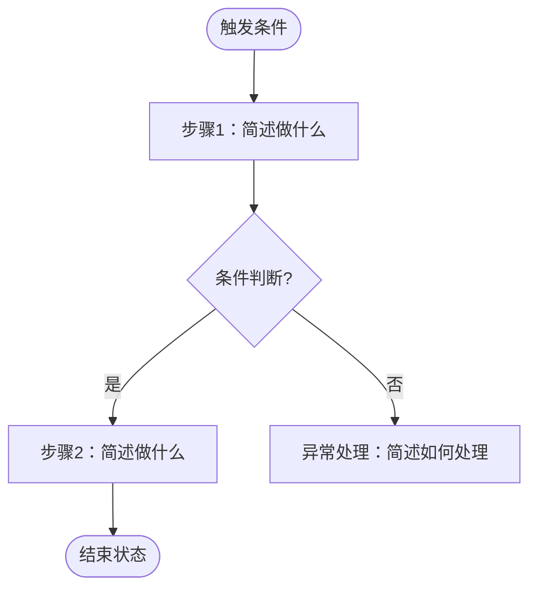
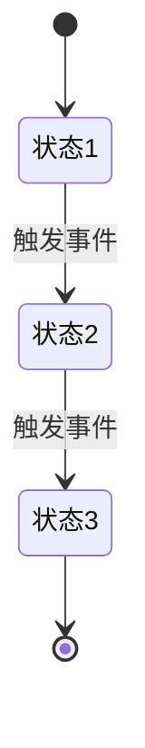
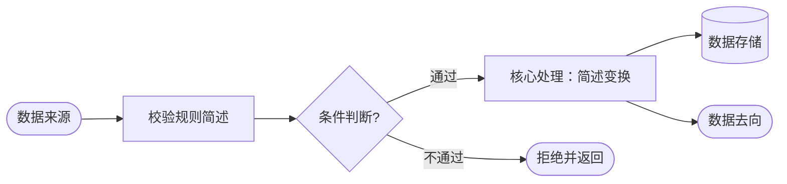
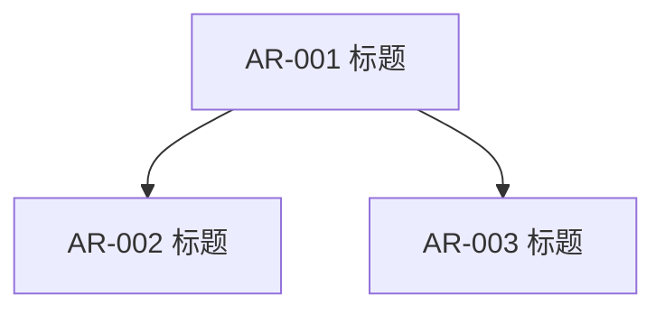
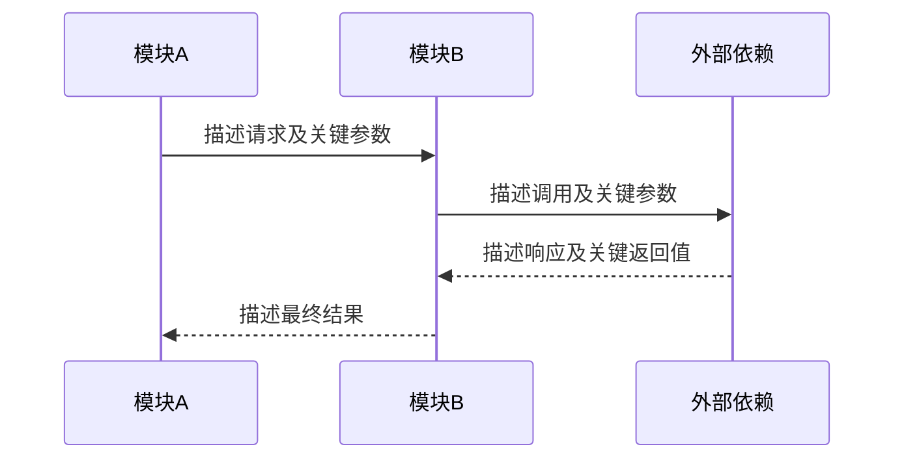

# 功能设计文档

## 文档信息

| 字段     | 内容                       | 取值规则 |
| -------- | -------------------------- | -------- |
| 功能名称 | *[填写]*                   | 取本次 SR 的功能名称 |
| 版本     | *[填写]*                   | 首次生成填 `1.0`；每轮 gate 整改后次版本号 +1（`1.1`、`1.2`…） |
| 作者     | `sr-design skill`          | 固定值，不填人名 |
| 日期     | *[填写]*                   | 本轮生成日期 |
| 状态     | *[草稿 / 整改稿（第 N 轮）]* | 首次生成填「草稿」；第 N 轮 gate 整改后填「整改稿（第 N 轮）」。门禁结论不写在本文档，见 `SR-design-gate.md` |

## 修订记录

| 版本     | 日期     | 作者     | 触发原因 | 变更说明 |
| -------- | -------- | -------- | -------- | -------- |
| *[填写]* | *[填写]* | `sr-design skill` | *[首次生成 / gate 整改（第 N 轮）/ 用户修改]* | *[填写]* |

---

## 0. 章节职责与去重规则

*[本节为写作约束，生成文档时保留本节标题和下表，供后续维护者与门禁核对。]*

同一事实只在权威位置写实质内容，其他章节引用而不复述。引用格式：`见 2.2 接口 X`。

| 信息类型 | 权威位置 | 其他位置的写法 |
|:---------|:---------|:---------------|
| 现状事实（模块/接口/数据） | 2.1 / 2.2 / 2.3 | 引用表格行，不复述内容 |
| 变更前后差异与兼容性分级 | 6 | 5 章只写目标设计，不写前后对照 |
| 对外接口契约 | 4 | 2.2 只写现状，8.3.2 只写跨 AR 内部契约 |
| 数据模型与数据流转 | 5.6 | 其他章节引用表名/字段名 |
| 模块交互时序 | 8.3.1（功能主流程）/ 8.3.2（跨 AR 契约） | 5 章用流程图表达分支，不画时序图 |
| 架构分层与模块职责 | 5.2 | 12 章只写对既有架构资产的增量 |
| 默认假设 | 附录 A | 正文标注假设编号 |

---

## 1. 需求背景

*[从功能视角描述：业务问题、需求范围、受益方、前置条件]*

---

## 2. 现状分析

*[分析当前系统与该需求相关的现状，为后续设计提供基线。本章是「变更前」事实的唯一权威来源，第 6 章的变更影响分析引用本章表格行，不复述。]*

### 2.1 相关模块现状

*[列出当前系统中与本次需求相关的模块，描述其职责、对外接口、关键约束]*

| 模块 | 当前职责 | 当前对外接口 | 与本需求的关系 |
|:-----|:---------|:-------------|:---------------|
| *[填写]* | *[填写]* | *[填写]* | *[承接变更/被影响/提供依赖]* |

### 2.2 相关接口现状

*[列出当前系统中与本次需求相关的接口，描述其协议、输入输出、调用关系]*

| 接口名称 | 协议 | 输入（关键字段） | 输出（关键字段） | 当前调用方 | 与本需求的关系 |
|:---------|:-----|:-----------------|:-----------------|:-----------|:---------------|
| *[填写]* | *[填写]* | *[填写]* | *[填写]* | *[填写]* | *[复用/修改/废弃/新增]* |

### 2.3 相关数据现状

*[列出当前系统中与本次需求相关的数据表或数据结构]*

| 表名/数据结构 | 当前用途 | 关键字段 | 与本需求的关系 |
|:--------------|:---------|:---------|:---------------|
| *[填写]* | *[填写]* | *[填写]* | *[复用/修改/废弃/新增]* |

### 2.4 现存问题与约束

*[描述当前系统在该需求领域存在的问题、性能瓶颈、架构约束，说明本次需求要解决哪些问题、受哪些约束限制]*

---

## 3. 外部依赖

*[从模块视角列出所有外部依赖]*

| 依赖名称 | 提供方   | 用途     | 接口概述                           | SLA / 超时 | 异常处理策略 |
| -------- | -------- | -------- | ---------------------------------- | ---------- | ------------ |
| *[填写]* | *[填写]* | *[填写]* | *[填写协议、方法、路径、关键字段]* | *[填写]*   | *[填写]*     |

*[补充：认证方式、限流要求、容错机制]*

设计意图：*[为什么选择这些外部依赖？是否有替代方案？为什么选择了当前方案？]*

---

## 4. 对外接口

*[列出本功能对系统外部暴露的接口（如 HTTP API、RPC 等），即外部调用方如何触发本功能。跨 AR 的内部接口契约见 8.3.2，此处不重复。本章不得判「不适用」。]*

| 接口名称 | 协议     | 用途     | 输入（关键字段）           | 输出（关键字段） | 异常返回 | 是否新增接口 |
| -------- | -------- | -------- | -------------------------- | ---------------- | -------- | ------------ |
| *[填写]* | *[填写]* | *[填写]* | *[填写字段名、类型、必填]* | *[填写]*         | *[填写]* | *[填写]*     |

*[每个接口补充：认证鉴权、幂等性、版本号、性能承诺、新增接口还是修改旧接口]*

设计意图：*[为什么定义这些对外接口？接口粒度为什么这样划分？与现状接口的关系是什么（复用/修改/新增）？]*

---

## 5. 功能设计

### 5.1 主成功场景（功能视角）

*[本节不得判「不适用」。]*

> 1. *[用户/外部系统做了什么]*
> 2. *[系统如何响应]*
>    ...
>    *[最终结果]*

设计意图：*[为什么是这个流程？考虑了哪些异常路径后选择了主流程？与现状流程的差异见第 6 章。]*

### 5.2 整体架构

*[描述本功能在系统中的位置和上下文关系，只涉猎当前需求需要知道的架构层级。本节是功能视角；对 `software_architecture.md` 这一架构资产的增量见第 12 章。本节不得判「不适用」。]*

设计意图：*[为什么选择这个架构分层？是否复用了现有层级？为什么新增/修改了某些层级？]*

#### 5.2.1 系统架构分层图

*[必须使用 mermaid graph TB 绘制，展示与当前功能相关的架构层级、模块及其交互关系。使用 subgraph 区分层级，标注关键调用关系]*

*[文字说明：解释各层级划分依据、模块间的调用关系、数据流向]*

#### 5.2.2 模块职责

*[列出图中各模块的职责、对外接口和关键说明。如果要新增模块，必须向用户说明必要性，并经过用户确认]*

| 模块         | 职责             | 对外接口            | 说明               |
| :--------- | :------------- | :-------------- | :--------------- |
| *[填写模块名称]* | *[填写该模块的核心职责]* | *[填写对外的接口/API]* | *[补充说明，如约束、依赖等]* |

### 5.3 流程图（功能视角）

*[必须使用 mermaid flowchart TD 绘制，展示主流程的分支决策。参与者之间的消息往返与同步/异步语义见 8.3。]*

*[文字说明：解释各分支的条件、各步骤的处理逻辑]*

### 5.4 关键步骤说明

*[对流程图或时序图中无法完整表达的步骤展开说明]*

> - *[步骤X]*：*[校验规则、状态变更、数据持久化内容、通知触发等]*

### 5.5 状态机

*[如果本功能涉及核心实体的状态流转，必须使用 mermaid stateDiagram-v2 绘制。如果明确不涉及，删除图表并说明原因。]*

*[文字说明：解释各状态的含义、进入条件和退出条件]*

### 5.6 数据设计

*[本节是数据的唯一权威位置，静态结构与流转路径都在此描述。]*

#### 5.6.1 数据模型

*[如果涉及新增或变更数据库表，描述表结构。不写 DDL，用业务语言描述字段含义，允许写表名、字段名、类型]*

| 表名     | 用途     | 关键字段                   | 变更类型     |
| :------- | :------- | :------------------------- | :----------- |
| *[填写]* | *[填写]* | *[填写字段名、类型、含义]* | *[新增/修改]* |

设计意图：*[为什么选择这个表结构？是否有其他数据建模方案？为什么选择了当前方案？]*

#### 5.6.2 数据流转

*[必须使用 mermaid flowchart 绘制一张数据流转图，展示数据从输入到输出的完整路径，同时体现处理节点与模块间路径。节点形状要求：圆角矩形表示外部实体/起止点、矩形表示处理步骤、菱形表示分支判断、圆柱形表示数据存储。标注每个节点处理的数据内容和变换]*

*[文字说明：解释数据在各节点间的转换规则、校验逻辑、持久化时机，以及数据在模块间的传递路径]*

#### 5.6.3 存储策略

*[持久化方式、保留策略、清理机制、数据量预估]*

### 5.7 异常场景、冲突场景、兼容场景

*[每类场景无内容时，删除对应行并在表下写明「<场景分类>不适用：<依据>」。]*

| 场景分类 | 场景名称 | 触发条件 | 系统表现（功能视角+模块视角） | 处理/恢复方式 |
| :------- | :------- | :------- | :---------------------------- | :------------ |
| 异常     | *[填写]* | *[填写]* | *[填写]*                      | *[填写]*      |
| 冲突     | *[填写]* | *[填写]* | *[填写]*                      | *[填写]*      |
| 兼容     | *[填写]* | *[填写]* | *[填写]*                      | *[填写]*      |

---

## 6. 变更影响分析

*[本章只写「变更前 → 变更后」的差异、兼容性判定与证据。变更前状态引用 2.1/2.2/2.3 的表格行（如「见 2.2 接口 X」），不复述内容。全新系统无既有行为基线时，判「不适用：全新系统，无既有行为基线」并说明依据。]*

### 6.1 分析基线

*[写明所依据的版本、配置、平台和既有行为基线来源。]*

| 基线维度 | 取值 | 来源 |
|:---------|:-----|:-----|
| 版本 | *[填写]* | *[填写]* |
| 配置/平台 | *[填写]* | *[填写]* |
| 既有行为基线 | *[填写]* | *[引用 2.x 或代码位置]* |

### 6.2 对外变化识别

*[逐项判断既有正确用法是否仍得到语义等价结果，并明确受影响对象和所需适配。检查维度：API/接口签名、参数与返回语义、错误码、输出格式与顺序、副作用与状态、调用顺序与幂等、并发与线程安全、CLI/配置/环境变量默认值、协议与持久化格式、日志与可观测输出。]*

| 变更对象 | 变更前（引用） | 变更后 | 既有用法是否语义等价 | 受影响对象与所需适配 | 分级 | 证据 |
|:---------|:---------------|:-------|:---------------------|:---------------------|:-----|:-----|
| *[填写]* | *[见 2.2 接口 X]* | *[填写]* | *[是/否/部分]* | *[填写]* | *[E0/E1/E2/E3/待确认]* | *[设计章节、代码位置、调用链检索结果、计划测试用例或评审结论]* |

### 6.3 上层影响传导

*[从变更点追踪直接调用方、封装/适配/框架层直至上层功能和用户场景；检查资源与性能变化向超时、重试、限流和容量的传导。结论为「无上层影响」时，必须写明追踪边界、调用方清单和证据。]*

| 变更点 | 直接调用方 | 传导路径（封装/框架/上层功能） | 影响结论 | 追踪边界与证据 |
|:-------|:-----------|:-------------------------------|:---------|:---------------|
| *[填写]* | *[填写]* | *[填写]* | *[填写]* | *[填写]* |

### 6.4 边界与异常

*[边界收紧或放宽的兼容性判定；失败语义、部分执行副作用、失败后能否重试及状态恢复。]*

| 边界/异常项 | 变更前行为 | 变更后行为 | 兼容性判定 | 失败语义与恢复方式 |
|:------------|:-----------|:-----------|:-----------|:-------------------|
| *[填写]* | *[填写]* | *[填写]* | *[兼容/部分兼容/不兼容]* | *[填写]* |

### 6.5 资源与性能

*[先分级为 `较小` / `较大` / `待确认`。`较小` 允许有依据的定性或数量级评估；`较大` 或 `待确认` 必须给出变更前后预估、增量或比例、峰值和估算模型，并说明变化原因。无论大小均须定义开发阶段的实测计划。]*

| 资源维度 | 变化分级 | 变更前预估 | 变更后预估 | 增量/比例与峰值 | 估算模型与变化原因 | 开发阶段实测计划 |
|:---------|:---------|:-----------|:-----------|:----------------|:-------------------|:-----------------|
| *[CPU/内存/IO/网络/存储]* | *[较小/较大/待确认]* | *[填写]* | *[填写]* | *[填写]* | *[填写]* | *[填写]* |

### 6.6 兼容与发布

*[源码/二进制/行为/数据/配置兼容性分别判断；升级、降级、回退和混合版本互操作；调用方适配、文档和发布说明更新；灰度观测与回退触发条件。]*

| 兼容维度 | 判定 | 依据 |
|:---------|:-----|:-----|
| 源码兼容 | *[兼容/不兼容/不适用]* | *[填写]* |
| 二进制兼容 | *[填写]* | *[填写]* |
| 行为兼容 | *[填写]* | *[填写]* |
| 数据兼容 | *[填写]* | *[填写]* |
| 配置兼容 | *[填写]* | *[填写]* |

| 发布维度 | 方案 |
|:---------|:-----|
| 升级路径 | *[填写]* |
| 降级/回退 | *[填写]* |
| 混合版本互操作 | *[填写]* |
| 调用方适配与文档更新 | *[填写]* |
| 灰度观测与回退触发条件 | *[填写]* |

### 6.7 分级结论

| 项 | 内容 |
|:---|:-----|
| 整体分级 | *[E0 / E1 / E2 / E3 / 待确认]* |
| 判定理由 | *[汇总 6.2-6.6 的逐项结论，说明为何定为该级]* |
| E3 专项（仅 E3 时填） | *[审批计划、迁移设计、回退设计]* |
| 待确认项 | *[逐项列出，每项写明责任人和完成时间；无则填「无」]* |

**证据要求**：每项「无影响」/「不变」结论必须有可反查的证据。以下内容不得单独作为无对外影响的证据，以此支撑的结论视同无证据：`改动行数小`、`仅内部重构`、`接口签名未变`、`单元测试通过`。设计阶段不要求代码提交、PR、运行日志或性能实测结果。

---

## 7. DFX 设计

### 7.1 可靠性

> - 故障检测与恢复机制
> - 数据备份与容灾策略
> - 降级与熔断策略

### 7.2 安全性

> - 认证与授权方案
> - 数据加密（传输、存储）
> - 输入校验与防注入
> - 审计日志

### 7.3 可服务性

> - 日志埋点设计
> - 监控指标与告警规则
> - 问题排查路径

### 7.4 性能设计

> - 核心接口预期 QPS / 延迟
> - 并发控制策略
> - 缓存策略
> - 资源占用预估
> - 数据量

---

## 8. AR 拆分与交互定义

*[本章内容基于现状分析、澄清结果和功能设计，且 AR 边界、依赖方向与跨 AR 接口选型均已在澄清阶段经用户逐题确认。设计目标：后续各 AR 的详细设计和开发可独立进行，阅读者仅凭本章加上单个 AR 在第 5 章中对应的功能设计内容，即可理解该 AR 的全貌。本章不得判「不适用」。]*

### 8.1 AR 拆分概览

*[列出本次设计涉及的所有 AR，每个 AR 需具备独立的交付价值。]*

| AR ID | AR 标题 | 核心职责与交付价值 | 承接模块 | 优先级 | 依赖 AR | 确认来源 |
|:------|:--------|:-------------------|:---------|:-------|:--------|:---------|
| *[填写，如 AR-001]* | *[填写]* | *[一句话描述要做什么，交付什么价值]* | *[模块名]* | *[P0/P1/P2]* | *[依赖的 AR ID，无则填"无"]* | *[问题池编号]* |

设计意图：*[为什么拆分成这些 AR？划分依据是什么？是否有替代的拆分方案？为什么选择了当前拆分方式？]*

### 8.2 AR 依赖关系图

*[必须使用 mermaid graph 绘制 AR 之间的依赖关系。每个节点代表一个 AR，节点文本使用 AR ID + 标题，有向边 A → B 表示 A 依赖 B（B 必须先完成或 B 提供了 A 需要的接口）。仅一个 AR 时，绘制单节点图并说明无依赖关系。]*

*[文字说明：解释依赖的含义——谁依赖谁、依赖什么、为什么是这样的依赖顺序。说明哪些 AR 可以并行开发，哪些必须串行。]*

### 8.3 交互时序与接口契约

#### 8.3.1 功能主流程时序（必填）

*[必须使用 mermaid sequenceDiagram 绘制功能级跨模块时序，全部参与模块在同一张图中，展示主成功场景的完整消息往返。本节与 AR 拆分粒度无关，单 AR 和免拆分场景同样必填，不得判「不适用」。]*

*[文字说明：解释各步骤的处理逻辑、数据变更、状态流转，明确每次调用是同步还是异步、调用方向和幂等性。]*

设计意图：*[为什么是这个交互顺序？同步还是异步的选择依据是什么？与现状交互方式的差异见第 6 章。]*

#### 8.3.2 AR 间接口契约

*[对每一对有依赖关系的 AR，定义模块间的交互接口契约。这是后续各 AR 独立开发的关键约束。若本次仅拆出一个 AR，或 AR 之间无依赖关系，删除本节表格并写明「不适用：<依据>」。]*

> 以下以 AR-A 依赖 AR-B 为例（对应模块间的交互），有多对依赖关系则复制多个子节。

##### [AR-A ID]（[AR-A 标题]，[模块A]）与 [AR-B ID]（[AR-B 标题]，[模块B]）的交互接口

| 交互方向 | 交互方式 | 接口/事件/数据描述 | 关键字段 | 触发条件与时机 | SLA / 超时 |
|:---------|:---------|:-------------------|:---------|:---------------|:-----------|
| 模块A 调用 模块B | *[同步接口/异步消息/共享数据]* | *[接口路径或事件名称]* | *[请求关键字段、响应关键字段]* | *[何时调用、调用频率]* | *[填写]* |
| 模块B 回调 模块A | *[同步接口/异步消息/共享数据]* | *[接口路径或事件名称]* | *[请求关键字段、响应关键字段]* | *[何时调用、调用频率]* | *[填写]* |

**接口契约补充说明**：
- **幂等性要求**：*[哪些接口需要幂等，如何实现]*
- **重试策略**：*[失败后的重试次数、间隔、退避策略]*
- **降级方案**：*[接口不可用时的降级行为]*
- **数据一致性**：*[跨 AR 的数据一致性保障方式]*

*[如该 AR 对的交互时序无法由 8.3.1 完整覆盖（如存在 8.3.1 未展示的多步往返或异常分支），在此补充一张 sequenceDiagram 并附文字说明；否则引用 8.3.1，不重复绘图。]*

### 8.4 AR 边界说明

*[对每个 AR，明确其范围和不在范围内的内容，防止开发时范围蔓延。]*

#### [AR ID]（[AR 标题]）

| 维度   | 范围内（该 AR 负责）     | 范围外（该 AR 不负责）              |
| :--- | :--------------- | :------------------------- |
| 功能   | *[具体做什么]*        | *[明确不做什么，由哪个 AR 负责]*       |
| 数据   | *[管理哪些数据、表]*     | *[哪些数据不归该 AR 管，由哪个 AR 负责]* |
| 接口   | *[对外暴露什么接口]*     | *[哪些接口由其他 AR 提供]*          |
| 异常处理 | *[该 AR 内部处理的异常]* | *[哪些异常应由调用方或依赖方处理]*        |

---

## 9. 需求追溯

*[本章不得判「不适用」。]*

### 9.1 需求承接

| 系统需求（SR） | 原文引用/位置 | 承接模块 | 分配需求（AR） | 分配需求描述 |
| :------------- | :------------ | :------- | :------------- | :----------- |
| *[填写]*       | *[original-requirement.md 中的原文引用或可定位位置]* | *[填写]* | *[AR ID，或「SR 整体承接」]* | *[填写]* |

### 9.2 范围裁剪记录

*[经用户确认为范围外、延期或不实现的原始需求，必须在此显式记录。无裁剪项时写明「无裁剪项」。缺记录或缺用户确认来源，门禁一律视为静默省略。]*

| 原始需求原文引用/位置 | 处置结论 | 处置理由 | 用户确认来源 |
| :-------------------- | :------- | :------- | :----------- |
| *[填写]* | *[范围外/延期/不实现]* | *[填写]* | *[问题池编号]* |

---

## 10. 配置设计

| 配置项   | 配置说明 | 默认值 | 生效范围 | 安全约束 |
| :------- | :------- | :----- | :------- | :------- |
| *[填写]* | *[填写]* | *[填写]* | *[填写]* | *[填写]* |

---

## 11. SR 整体验收标准

*[本章不得判「不适用」。]*

### 11.1 验收标准总览

> - **正常流程**：*[主成功场景的验证方式]*
> - **异常处理**：*[每个异常/冲突/兼容场景的触发及预期行为验证]*
> - **接口契约**：*[对外接口与跨 AR 接口输入输出符合性验证]*
> - **数据一致性**：*[事务场景一致性级别要求]*
> - **性能指标**：*[核心接口延迟、并发量等量化阈值]*
> - **DFX**：*[可靠性、可服务性、安全配置生效的验证方式]*
> - **AR 覆盖**：*[每个 AR 的交付价值均有对应验收]*
>
> 本功能验收通过需满足以下全部条件：11.2 中所有测试用例执行通过，对外接口与跨 AR 接口契约校验通过，核心接口性能指标达到预期阈值，DFX 要求（可靠性、可服务性、安全）均已验证且无高危漏洞，跨模块事务场景数据一致性达标，原始需求中所有明确的可验收行为均有用例覆盖。

### 11.2 系统层级黑盒测试用例

*[以下表格描述从系统外部视角（用户/调用方）对本次需求涉及的功能进行黑盒验证的测试用例。「覆盖对象」列标注该用例覆盖哪一类验收对象，六类必须全部出现至少一次：`主流程`、`异常/冲突/兼容`、`接口契约`、`数据一致性`、`DFX 阈值`、`原始需求条目`。一个用例可覆盖多类，用逗号分隔。]*

| 序号 | 覆盖对象 | 测试场景 | 前置条件 | 测试步骤 | 预期结果 |
|:-------|:---------|:---------|:---------|:---------|:---------|
| TC-001 | 主流程 | *[描述测试的场景]* | *[执行测试前系统及数据需要满足的状态]* | 1. *[步骤1：具体操作]* 2. *[步骤2：具体操作]* 3. *[步骤N：具体操作]* | *[每一步的期望反馈及最终系统状态]* |
| TC-002 | 异常/冲突/兼容 | *[填写]* | *[填写]* | 1. *[填写]* 2. *[填写]* | *[填写]* |
| TC-003 | 接口契约 | *[填写]* | *[填写]* | 1. *[填写]* 2. *[填写]* | *[填写]* |
| TC-004 | 数据一致性 | *[填写]* | *[填写]* | 1. *[填写]* 2. *[填写]* | *[填写]* |
| TC-005 | DFX 阈值 | *[填写]* | *[填写]* | 1. *[填写]* 2. *[填写]* | *[填写]* |
| TC-006 | 原始需求条目 | *[填写，注明对应的原始需求原文引用]* | *[填写]* | 1. *[填写]* 2. *[填写]* | *[填写]* |

**测试用例说明**：
- 主流程用例覆盖 5.1 中描述的主成功场景。
- 异常/冲突/兼容用例覆盖 5.7 中识别的各场景。
- 接口契约用例覆盖第 4 章对外接口与 8.3.2 跨 AR 接口。
- 数据一致性用例覆盖 5.6 中涉及的跨模块事务场景。
- DFX 阈值用例覆盖第 7 章中可量化的可靠性、性能与安全要求。
- 原始需求条目用例覆盖 `original-requirement.md` 中明确要求但未被上述用例覆盖的可验收行为。
- *[如用例数较多，可按功能模块或流程分支分组组织。]*

---

## 12. [可选] 软件架构

*[本章为可选章节：允许判「不适用」，但必须保留本章标题并写明依据，不得整章省略。本章是资产视角，只写对既有架构资产的增量；功能视角的分层图见 5.2。按实际情况选择一种填写，删除其余两种。]*

**情况A：已有架构文档**
*[引用 `.sdd/software_architecture.md`，说明本功能在既有架构中的位置，以及本次设计对该文档的增量（新增/修改的模块、层级、依赖关系）]*

**情况B：架构基线缺失（存量代码无架构文档）**
*[写明 `.sdd/software_architecture.md` 不存在，基于代码分析简述模块现状，指出改动点与影响边界。门禁会据此对「模块边界」维度做降级检查并记录欠账]*

**情况C：新增组件**
*[描述新组件的角色、职责、边界，以及它在既有架构中的接入点]*

---

## 13. 三方件约束

| 名称     | 版本     | 许可证   | 使用目的 | 约束/风险 |
| :------- | :------- | :------- | :------- | :-------- |
| *[填写]* | *[填写]* | *[填写]* | *[填写]* | *[约束/风险]*  |

---

## 附录 A. 默认假设清单

*[记录本次设计中采用的所有默认假设。正文对应位置以「（基于假设 N）」标注，编号与本清单一致。无默认假设时写明「无默认假设」。]*

| 编号 | 假设内容 | 依据 | 正文引用位置 |
|:-----|:---------|:-----|:-------------|
| 假设 1 | *[填写]* | *[业界惯例/项目既有模式/代码现状]* | *[章节号]* |

---

> **使用说明**
> - 所有 *[斜体占位符]* 必须替换为实际分析结果，不得保留。
> - 除标注 `[可选]` 的章节外，章节不可缺失。`[可选]` 的含义是「允许判不适用」，仍需保留章节标题并写明依据，不得整章省略。
> - 表格不得只有表头。确无内容时删除表格，写明「不适用：<依据>」。以下位置承载设计主干，任何情况下都不得判不适用：第 4 章对外接口、5.1 主成功场景、5.2 整体架构、第 8 章全章（含 8.3.1）、第 9 章需求追溯、第 11 章验收标准。这些位置内容缺失时必须停止工作，回到澄清流程补齐，严禁私自标注不适用。
> - 必填 mermaid 图共 5 张：5.2.1 架构分层图、5.3 流程图、5.6.2 数据流转图、8.2 AR 依赖关系图、8.3.1 功能主流程时序图。条件图 2 张：5.5 状态机（涉及状态流转时）、8.3.2 AR 对时序（8.3.1 未覆盖时）。
> - 同一事实只在第 0 节指定的权威位置写实质内容，其他位置引用不复述。
